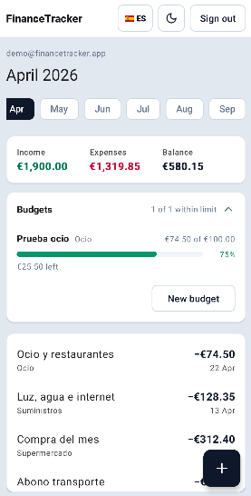
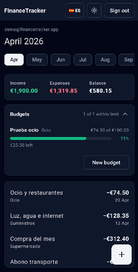
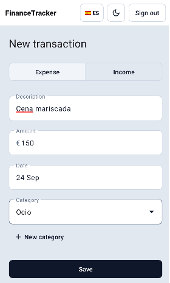
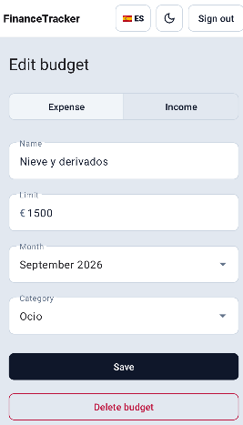
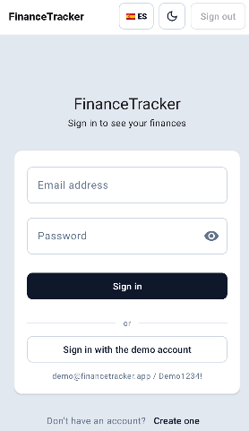

# 📱 FinanceTracker Android

**English** · [Español](README.es.md)

Android client for [FinanceTracker](https://github.com/antonicr1986/FinanceTracker),
a personal finance REST API written in .NET 8.

**This is one of three clients of that API**, alongside
[financetracker-web](https://github.com/antonicr1986/financetracker-web), in
Next.js, and [financetracker-desktop](https://github.com/antonicr1986/financetracker-desktop),
in C# and WPF. Writing more than one consumer is what turns an API into a
contract: the same endpoints, the same error codes and the same business rules,
reached from a different language and a different platform.

There is a **public demo account**, the same one the web client uses, reachable
in one tap from the sign-in screen. The API sleeps after 20 minutes of
inactivity, so the first sign-in of the day takes a few seconds while the app
service and the database wake up — the screen says so while it waits.

**[Download the latest APK](https://github.com/antonicr1986/financetracker-android/releases/latest)**
— signed, for Android 7.0 or later. Installing it needs "install unknown apps"
allowed for the browser or file manager you open it from.

## ✨ What it does

- **Sign-in with JWT**, with one-tap entry into the demo account.
- **Account registration**, validated like the web client, which then signs in
  with the same credentials and opens the dashboard.
- **Month selector**: a chip per month that has data, so the whole history is
  reachable and not just the current month.
- **Totals for the selected month** — income, expenses and balance — derived on
  the device from the full history.
- **Transaction list** with category, date and a signed amount.
- **Recording a transaction**, with a native date picker and a category
  dropdown filtered by the chosen type: the API rejects an expense filed under
  an income category, so it is never offered.
- **Editing and deleting a transaction**: tapping one opens it prefilled in the
  same form; deleting asks for confirmation first.
- **Monthly budgets** on the dashboard, like the web client: spent of total, a
  bar that turns amber at 80% and red at 100%, and what is left or over. They
  can be created, edited and deleted, for one category or for all of a type.
  The API computes the figures; the app only picks the month's.
- **Expenses by category**: the month's expenses grouped by category, largest
  first, each with a bar relative to the largest one.
- **Filters** by description, type and category, resolved on the device over
  the month already loaded — as in the web client, with no new request. The
  totals stay those of the whole month; only the list is filtered.
- **Collapsible sections** — budgets, the breakdown and the filters — whose
  one-line summary stays visible when folded ("1 of 2 within limit",
  "Largest: …", "Showing 3 of 12").
- **The whole dashboard scrolls as one page**, with pull to refresh from
  anywhere on it.
- **A clear message when the session expires**: the sign-in screen says why
  the user is back there, instead of a silent return.
- **Creating a category from the form**, of the chosen type, which is then
  selected — the same flow as the web client.
- **Pull to refresh**, and a retry button when loading fails.
- **The same look as the web client**: Tailwind's slate palette mapped onto the
  Material 3 roles, white cards on a grey background, and a shared top bar on
  every screen.
- **Light and dark themes**, switched from the top bar and remembered; until
  one is chosen the app follows the system.
- **Spanish and English**, switched from the top bar. Texts, dates and amounts
  follow the language (`es-ES` / `en-GB`, always in euros), as in the web client.

## 🚧 What it does not do

The web client is the complete one. This one is deliberately smaller, built
around what a phone is good at: checking quickly and recording on the spot.

- No trend chart across the year. Categories can be created, but not renamed
  or deleted.

## 🖼️ Preview

The dashboard in light and dark themes: the month's totals, the budgets with
how much of each is spent, and the transactions.

  
  

Recording a transaction and a budget, with the same form for creating and
editing.

  
  

The sign-in screen, with one-tap entry into the demo account and the language
and theme switches in the top bar.

## 🧰 Stack

- **Kotlin**, minSdk 24
- **Retrofit 3** with Gson, over OkHttp
- **Coroutines**, so every network call reads top to bottom
- **Material 3** and view binding
- **JUnit** for the unit tests

## 📁 Project structure

    app/src/main/java/.../
      data/           Retrofit client, session and repository
        model/        The API DTOs
      domain/         Months, totals, budgets, filters, breakdown and form rules — pure Kotlin
      ui/             Top bar, theme, language, adapter and formats
      BaseActivity    Theme and language switching without flashing
      LoginActivity, RegisterActivity, MainActivity, NewTransactionActivity

`domain/` holds no reference to Android on purpose. That is what lets its tests
run on the JVM in milliseconds, with no emulator, and it is the same split the
web client makes with `derive.ts`.

## 🧠 Decisions worth reading

**Dates never become date objects.** The API returns `2026-09-22T00:00:00` and
the month is taken by cutting the string. Building a date would apply the
device's time zone and file the 1st of a month under the previous one for
anyone west of Greenwich. The date picker is the same problem mirrored: it
returns midnight **UTC**, so that value is formatted with a UTC formatter.

**The token lives in plain SharedPreferences.** Google deprecated
`EncryptedSharedPreferences` in 2025 in favour of platform APIs. An app's
private storage is already isolated by the sandbox; what the encryption added
was protection against backups and physical extraction. The first is covered by
`android:allowBackup="false"`, and against the second the real mitigation is
that the token expires in 60 minutes.

**A 401 means two different things.** On the sign-in screen there was no session
yet, so it is a wrong password. On the dashboard there was a token and the API
refused it, so the session expired and the user goes back to sign in. Same
status code, two messages.

**Theme and language changes do not recreate the screen.** Android applies them
with `recreate()`, which removes the old window before the new one is drawn —
that gap is a visible flash. The activities declare `uiMode|locale` in
`configChanges`, so Android only notifies them, and `BaseActivity` restarts the
screen **with no animation at all**, carrying its saved state in the intent:
what was typed stays typed, and the keyboard stays open only if it already was.
The dashboard reuses the transactions it already had instead of calling the
API again. The filter drop-downs are excluded from that restore
(`android:saveEnabled="false"`): their value always comes from the chosen
filter, and restoring it as raw view state left one showing the other
language's label and ignoring taps.

**The language uses AppCompat per-app locales.** The choice is stored by the
system on Android 13+ (it also shows in the system app settings) and by
`AppLocalesMetadataHolderService` on older versions, so the app keeps no copy
of it. The theme, which has no system equivalent, is kept in its own
preferences file, separate from the session, so signing out does not reset it.

## 🧪 Tests

`./gradlew test` — 56 unit tests, no emulator needed.

Six cover the month derivations. Four cover the paging loop against a fake API,
including the case the real world hides: with fewer than 100 transactions the
second page is never requested, so a bug there would only surface once a user
accumulated data.

Eight cover the budgets (which month's are shown, the 80% and 100% colour
thresholds, the month picker across a year boundary). Seven cover the filters
(a search that ignores case and surrounding spaces, a blank one that filters
nothing, type and category — including "no category" — combined with the
search, and the category list offered in the drop-down), and five the breakdown (expenses only,
largest first, transactions without a category grouped under one label).
Eleven cover the form rules (registration, amounts typed with a comma or a dot,
duplicate categories), seven the formats in each language (`€12,345.60` versus
`12.345,60 €`, always in euros), and eight check that the API calls leave
with the method, path and body the .NET API expects — against an OkHttp
interceptor instead of a server, so they need no network.

## 🔄 Automation

- **CI** on every push and pull request: secret scanning, unit tests and a
  debug APK, downloadable from the run itself.
- **Release** on every version tag (`v1.2.3`): runs the tests, signs the APK
  with a key kept in the repository secrets, verifies the signature with
  `apksigner`, and publishes a GitHub Release with the APK and a changelog
  since the previous tag. The version name and code come from the tag, so the
  number is never edited by hand. The key is written to the runner's temporary
  folder only for that run and removed afterwards.
- **Secret scanning** with gitleaks across the full history, with the same
  configuration as the other repositories in this project.
- The JDK is pinned to the one the project is developed with, so the CI and the
  desk compile the same way.

## ⚙️ Running locally

Android Studio, JDK 17 or later, and a device or emulator on Android 7.0+.

    ./gradlew test
    ./gradlew assembleDebug

The API URL is set at build time in `app/build.gradle.kts`, as
`API_BASE_URL`. It points at the deployed API; change it there to aim a build
at a local one.

## ✍️ Author

Antonio Company - [GitHub](https://github.com/antonicr1986) ·
[LinkedIn](https://www.linkedin.com/in/antoniocompany/)
